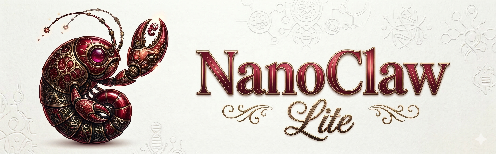
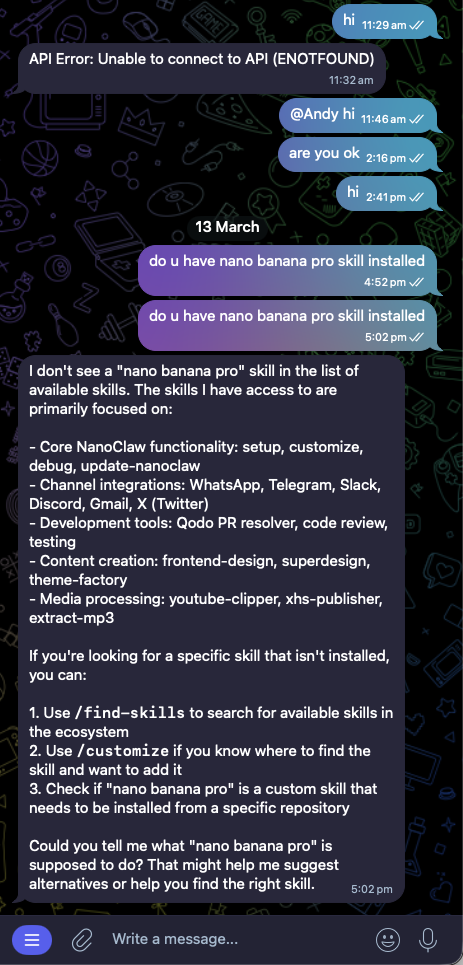

<p align="center">
  
</p>

<p align="center">
  A lightweight AI assistant that runs Claude directly in-process. No containers, no rebuilds, no 10GB disk waste. Just copy-paste skills and go.
</p>

<p align="center">
  <a href="https://nanoclaw.dev">nanoclaw.dev</a>&nbsp; • &nbsp;
  <a href="README_zh.md">中文</a>&nbsp; • &nbsp;
  <a href="https://discord.gg/VDdww8qS42"></a>&nbsp; • &nbsp;
  <a href="repo-tokens"></a>
</p>
Using Claude Code, NanoClaw can dynamically rewrite its code to customize its feature set for your needs.

**New:** First AI assistant to support [Agent Swarms](https://code.claude.com/docs/en/agent-teams). Spin up teams of agents that collaborate in your chat.

## Why I Built NanoClaw Lite ?

OpenClaw & NanoClaw are impressive, but I needed something lighter. 
- Containers deploy as code on VPS rather than as image on container platform (ECS, or whatever)
- Cheaper
- Most AI assistants don't need that complexity.
- Leverage `claude-sdk-phython` as agent layer
- @Andrej Karpathy likes its simplicity, (credit: nanoclaw)
- Runs directly in-process. 
- No containers, no rebuilds, on each skill/mcp changes.
  - TBH: this is the main point, gmail-mcp would taking low tier model to figure it out for 10mins. Unaccetabple.
- No wasted disk space. Claim back 10GB disk images taken by nanoclaw
- Seperate personal workspace data from claw agent. [#trade-off]
  - claw do have convience in using Obsidian for example, but you can also add Notion api to make it send notes to the cloud.
  - If you run from local, don't forget to tailscale, VPN.

Skills are just copy-paste into the plugins folder. Test instantly via MCP. Deploy anywhere—your VPS, your laptop, a tiny cloud instance.

Caveat: you still have to guard your secret and network.
However, running away from laptop (unlike openclaw). Your personal data are seperated from Cloud attacks. 

## Preview

<p align="center"> 
  
</p>

## Quick Start

```bash
gh repo fork qwibitai/nanoclaw --clone
cd nanoclaw
npm install
npm run dev
```

<details>
<summary>Without GitHub CLI</summary>

1. Fork [qwibitai/nanoclaw](https://github.com/qwibitai/nanoclaw) on GitHub (click the Fork button)
2. `git clone https://github.com/<your-username>/nanoclaw.git`
3. `cd nanoclaw`
4. `npm install`
5. `npm run dev`

</details>

Then run `/setup` in Claude Code to configure channels and integrations.

> **Note:** Commands prefixed with `/` (like `/setup`, `/add-whatsapp`) are [Claude Code skills](https://code.claude.com/docs/en/skills). Type them inside the `claude` CLI prompt, not in your regular terminal. If you don't have Claude Code installed, get it at [claude.com/product/claude-code](https://claude.com/product/claude-code).

## Philosophy

**Small enough to understand.** One process, a few source files and no microservices. If you want to understand the full NanoClaw codebase, just ask Claude Code to walk you through it.

**Lightweight by design.** No containers, no rebuilds, no 10GB disk waste. Runs directly in-process. Deploy anywhere—VPS, laptop, tiny cloud instance. Zero runtime tax.

**Built for the individual user.** NanoClaw isn't a monolithic framework; it's software that fits each user's exact needs. Instead of becoming bloatware, NanoClaw is designed to be bespoke. You make your own fork and have Claude Code modify it to match your needs.

**Customization = code changes.** No configuration sprawl. Want different behavior? Modify the code. The codebase is small enough that it's safe to make changes.

**AI-native.**
- No installation wizard; Claude Code guides setup.
- No monitoring dashboard; ask Claude what's happening.
- No debugging tools; describe the problem and Claude fixes it.

**Skills are plugins.** Add channels or features by copying skills into `.claude/skills/`. Test instantly via MCP. No rebuilds, no restarting.

**Best harness, best model.** NanoClaw runs on the Claude Agent SDK, which means you're running Claude Code directly. Claude Code is highly capable and its coding and problem-solving capabilities allow it to modify and expand NanoClaw and tailor it to each user.

## What It Supports

- **Multi-channel messaging** - Talk to your assistant from WhatsApp, Telegram, Discord, Slack, or Gmail. Add channels with skills like `/add-whatsapp` or `/add-telegram`. Run one or many at the same time.
- **Isolated group context** - Each group has its own `CLAUDE.md` memory and isolated filesystem.
- **Main channel** - Your private channel (self-chat) for admin control; every group is completely isolated
- **Scheduled tasks** - Recurring jobs that run Claude and can message you back
- **Web access** - Search and fetch content from the Web
- **Agent Swarms** - Spin up teams of specialized agents that collaborate on complex tasks. NanoClaw is the first personal AI assistant to support agent swarms.
- **Optional integrations** - Add Gmail (`/add-gmail`) and more via skills
- **MCP testing** - Test skills instantly via MCP without rebuilds

## Usage

Talk to your assistant with the trigger word (default: `@Andy`):

```
@Andy send an overview of the sales pipeline every weekday morning at 9am (has access to my Obsidian vault folder)
@Andy review the git history for the past week each Friday and update the README if there's drift
@Andy every Monday at 8am, compile news on AI developments from Hacker News and TechCrunch and message me a briefing
```

From the main channel (your self-chat), you can manage groups and tasks:
```
@Andy list all scheduled tasks across groups
@Andy pause the Monday briefing task
@Andy join the Family Chat group
```

## Customizing

NanoClaw doesn't use configuration files. To make changes, just tell Claude Code what you want:

- "Change the trigger word to @Bob"
- "Remember in the future to make responses shorter and more direct"
- "Add a custom greeting when I say good morning"
- "Store conversation summaries weekly"

Or run `/customize` for guided changes.

The codebase is small enough that Claude can safely modify it.

## Contributing

**Don't add features. Add skills.**

If you want to add Telegram support, don't create a PR that adds Telegram to the core codebase. Instead, fork NanoClaw, make the code changes on a branch, and open a PR. We'll create a `skill/telegram` branch from your PR that other users can merge into their fork.

Users then run `/add-telegram` on their fork and get clean code that does exactly what they need, not a bloated system trying to support every use case.

### RFS (Request for Skills)

Skills we'd like to see:

**Communication Channels**
- `/add-signal` - Add Signal as a channel

**Session Management**
- `/clear` - Add a `/clear` command that compacts the conversation (summarizes context while preserving critical information in the same session). Requires figuring out how to trigger compaction programmatically via the Claude Agent SDK.

## Requirements

- macOS, Linux, or Windows
- Node.js 20+
- [Claude Code](https://claude.ai/download)

## Architecture

```
Channels --> SQLite --> Polling loop --> Claude Agent SDK (in-process) --> Response
```

Single Node.js process. Channels are added via skills and self-register at startup — the orchestrator connects whichever ones have credentials present. Claude Agent SDK runs directly in-process with group isolation. Per-group message queue with concurrency control. IPC via filesystem.

For the full architecture details, see [docs/SPEC.md](docs/SPEC.md).

Key files:
- `src/index.ts` - Orchestrator: state, message loop, agent invocation
- `src/channels/registry.ts` - Channel registry (self-registration at startup)
- `src/ipc.ts` - IPC watcher and task processing
- `src/router.ts` - Message formatting and outbound routing
- `src/group-queue.ts` - Per-group queue with global concurrency limit
- `src/agent-runner.ts` - Runs Claude Agent SDK directly in-process
- `src/task-scheduler.ts` - Runs scheduled tasks
- `src/db.ts` - SQLite operations (messages, groups, sessions, state)
- `groups/*/CLAUDE.md` - Per-group memory

## FAQ

**Can I run this on Linux? Windows? macOS?**

Yes. NanoClaw runs on all three platforms. It's a pure Node.js application with no container dependencies.

**Is this secure?**

Agents run with filesystem isolation at the application level. Each group has its own isolated filesystem context. You should still review what you're running, but the codebase is small enough that you actually can. See [docs/SECURITY.md](docs/SECURITY.md) for the full security model.

**Why no configuration files?**

We don't want configuration sprawl. Every user should customize NanoClaw so that the code does exactly what they want, rather than configuring a generic system. If you prefer having config files, you can tell Claude to add them.

**Can I use third-party or open-source models?**

Yes. 

NanoClawLite supports any Claude API-compatible model endpoint. Set these environment variables in your `.env` file:

Hint: modify `.env.example` file.

```bash
ANTHROPIC_BASE_URL=https://your-api-endpoint.com
ANTHROPIC_AUTH_TOKEN=your-token-here
```

This allows you to use:
- Local models via [Ollama](https://ollama.ai) with an API proxy
- Open-source models hosted on [Together AI](https://together.ai), [Fireworks](https://fireworks.ai), etc.
- Custom model deployments with Anthropic-compatible APIs

Note: The model must support the Anthropic API format for best compatibility.

**How do I debug issues?**

Ask Claude Code. "Why isn't the scheduler running?" "What's in the recent logs?" "Why did this message not get a response?" That's the AI-native approach that underlies NanoClaw.

**Why isn't the setup working for me?**

If you have issues, during setup, Claude will try to dynamically fix them. If that doesn't work, run `claude`, then run `/debug`. If Claude finds an issue that is likely affecting other users, open a PR to modify the setup SKILL.md.

**What changes will be accepted into the codebase?**

Only security fixes, bug fixes, and clear improvements will be accepted to the base configuration. That's all.

Everything else (new capabilities, OS compatibility, hardware support, enhancements) should be contributed as skills.

This keeps the base system minimal and lets every user customize their installation without inheriting features they don't want.

## Community

Questions? Ideas? [Join the Discord](https://discord.gg/VDdww8qS42).

## Changelog

See [CHANGELOG.md](CHANGELOG.md) for breaking changes and migration notes.

## License

MIT
